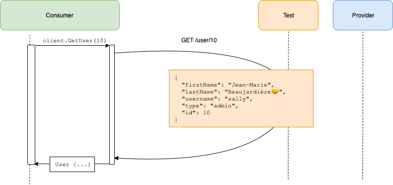
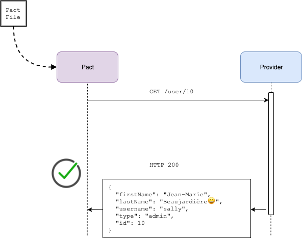

# Pact Go workshop

## Introduction
This workshop is aimed at demonstrating core features and benefits of contract testing with Pact. It uses a simple example

Whilst contract testing can be applied retrospectively to systems, we will follow the [consumer driven contracts](https://martinfowler.com/articles/consumerDrivenContracts.html) approach in this workshop - where a new consumer and provider are created in parallel to evolve a service over time, especially where there is some uncertainty with what is to be built.

This workshop should take from 1 to 2 hours, depending on how deep you want to go into each topic.

**Workshop outline**:

- [step 1: **create consumer**](//github.com/pact-foundation/pact-workshop-go/tree/step1): Create our consumer before the Provider API even exists
- [step 2: **unit test**](//github.com/pact-foundation/pact-workshop-go/tree/step2): Write a unit test for our consumer
- [step 3: **pact test**](//github.com/pact-foundation/pact-workshop-go/tree/step3): Write a Pact test for our consumer
- [step 4: **pact verification**](//github.com/pact-foundation/pact-workshop-go/tree/step4): Verify the consumer pact with the Provider API
- [step 5: **fix consumer**](//github.com/pact-foundation/pact-workshop-go/tree/step5): Fix the consumer's bad assumptions about the Provider
- [step 6: **pact test**](//github.com/pact-foundation/pact-workshop-go/tree/step6): Write a pact test for `404` (missing User) in consumer
- [step 7: **provider states**](//github.com/pact-foundation/pact-workshop-go/tree/step7): Update API to handle `404` case
- [step 8: **pact test**](//github.com/pact-foundation/pact-workshop-go/tree/step8): Write a pact test for the `401` case
- [step 9: **pact test**](//github.com/pact-foundation/pact-workshop-go/tree/step9): Update API to handle `401` case
- [step 10: **request filters**](//github.com/pact-foundation/pact-workshop-go/tree/step10): Fix the provider to support the `401` case
- [step 11: **pact broker**](//github.com/pact-foundation/pact-workshop-go/tree/step11): Implement a broker workflow for integration with CI/CD

_NOTE: Each step is tied to, and must be run within, a git branch, allowing you to progress through each stage incrementally. For example, to move to step 2 run the following: `git checkout step2`_

## Scenario

There are two components in scope for our workshop.

1. Admin Service (Consumer). Does Admin-y things, and often needs to communicate to the User service. But really, it's just a placeholder for a more useful consumer (e.g. a website or another microservice) - it doesn't do much!
1. User Service (Provider). Provides useful things about a user, such as listing all users and getting the details of individuals.

For the purposes of this workshop, we won't implement any functionality of the Admin Service, except the bits that require User information.

## Step 1 - Simple Consumer calling Provider

We need to first create an HTTP client to make the calls to our provider service:


*NOTE*: even if the API client had been been graciously provided for us by our Provider Team, it doesn't mean that we shouldn't write contract tests - because the version of the client we have may not always be in sync with the deployed API - and also because we will write tests on the output appropriate to our specific needs.

This User Service expects a `user` path parameter, and then returns some simple json back:


Great! We've created a client (see the `consumer/client` package).

We can run the client with `make run-consumer` - it should fail with an error, because the Provider is not running.

*Move on to [step 2](//github.com/pact-foundation/pact-workshop-go/tree/step2): Write a unit test for our consumer*

## Step 2 - Client Tested but integration fails

Now lets create a basic test for our API client. We're going to check 2 things:

1. That our client code hit the expected endpoint
1. That the response is marshalled into a `User` object, with the correct ID

*consumer/client/client_test.go*

```go
func TestClientUnit_GetUser(t *testing.T) {
	userID := 10

	// Setup mock server
	server := httptest.NewServer(http.HandlerFunc(func(rw http.ResponseWriter, req *http.Request) {
		assert.Equal(t, req.URL.String(), fmt.Sprintf("/user/%d", userID))
		user, _ := json.Marshal(model.User{
			FirstName: "Sally",
			LastName:  "McDougall",
			ID:        userID,
			Type:      "admin",
			Username:  "smcdougall",
		})
		rw.Write([]byte(user))
	}))
	defer server.Close()

	// Setup client
	u, _ := url.Parse(server.URL)
	client := &Client{
		BaseURL: u,
	}
	user, err := client.GetUser(userID)
	assert.NoError(t, err)

	// Assert basic fact
	assert.Equal(t, user.ID, userID)
}

```



Let's run this spec and see it all pass:

```
$ make unit

--- 🔨Running Unit tests
go test -count=1 github.com/pact-foundation/pact-workshop-go/consumer/client -run 'TestClientUnit'
ok  	github.com/pact-foundation/pact-workshop-go/consumer/client	10.196s
```

Meanwhile, our provider team has started building out their API in parallel. Let's run our client against our provider (you'll need two terminals to do this):


```
# Terminal 1
$ make run-provider 

2019/10/28 18:24:37 API starting: port 8080 ([::]:8080)

# Terminal 2
make run-consumer

2019/10/28 18:25:57 api unavailable
exit status 1
make: *** [run-consumer] Error 1

```

Doh! The Provider doesn't know about `/users/:id`. On closer inspection, the provider only knows about `/user/:id` and `/users`.

We need to have a conversation about what the endpoint should be, but first...

*Move on to [step 3](//github.com/pact-foundation/pact-workshop-go/tree/step3)*

## Step 3 - Pact to the rescue

Let us add Pact to the project and write a consumer pact test for the `GET /users/:id` endpoint. Note how similar it looks to our unit test:

*consumer/client/client_pact_test.go:*

```go
	t.Run("the user exists", func(t *testing.T) {
		id := 10

		pact.
			AddInteraction().
			Given("User sally exists").
			UponReceiving("A request to login with user 'sally'").
			WithRequest(request{
				Method:  "GET",
				Path:    term("/users/10", "/user/[0-9]+"),
				Headers: headersWithToken,
			}).
			WillRespondWith(dsl.Response{
				Status:  200,
				Body:    dsl.Match(model.User{}),
				Headers: commonHeaders,
			})

		err := pact.Verify(func() error {
			user, err := client.WithToken("2019-01-01").GetUser(id)

			// Assert basic fact
			if user.ID != id {
				return fmt.Errorf("wanted user with ID %d but got %d", id, user.ID)
			}

			return err
		})

		if err != nil {
			t.Fatalf("Error on Verify: %v", err)
		}
	})
```


This test starts a mock server a random port that acts as our provider service. To get this to work we update the URL in the `Client` that we create, after initialising Pact.

Running this test still passes, but it creates a pact file which we can use to validate our assumptions on the provider side, and have conversation around.

```console
$ make consumer
```

A pact file should have been generated in *pacts/goadminservice-gouserservice.json*

*Move on to [step 4](//github.com/pact-foundation/pact-workshop-go/tree/step4)*

## Step 4 - Verify the provider


We now need to validate the pact generated by the consumer is valid, by executing it against the running service provider, which should fail:

```console
$ make provider

--- 🔨Running Provider Pact tests
go test -count=1 -tags=integration github.com/pact-foundation/pact-workshop-go/provider -run "TestPactProvider"
2019/10/30 11:29:49 API starting: port 62059 ([::]:62059)
--- FAIL: TestPactProvider (11.30s)
    pact.go:416: Verifying a pact between GoAdminService and GoUserService Given User sally exists A request to login with user 'sally' with GET /users/10 returns a response which has a matching body
        Actual: [{"firstName":"Jean-Marie","lastName":"de La Beaujardière😀😍","username":"sally","type":"admin","id":10}]

        Diff
        --------------------------------------
        Key: - is expected
             + is actual
        Matching keys and values are not shown

        -{
        -  "firstName": "Sally",
        -  "id": 10,
        -  "lastName": "McSmiley Face😀😍",
        -  "type": "admin",
        -  "username": "sally"
        -}
        +[
        +  {
        +    "firstName": "Jean-Marie",
        +    "lastName": "de La Beaujardière😀😍",
        +    "username": "sally",
        +    "type": "admin",
        +    "id": 10
        +  },
        +]


        Description of differences
        --------------------------------------
        * Expected a Hash (like {"firstName"=>"Sally", "id"=>10, "lastName"=>"McSmiley Face😀😍", "type"=>"admin", "username"=>"sally"}) but got an Array ([{"firstName"=>"Jean-Marie", "lastName"=>"de La Beaujardière😀😍", "username"=>"sally", "type"=>"admin", "id"=>10}]) at $

    user_service_test.go:43: error verifying provider: exit status 1
```

The test has failed, as the expected path `/users/:id` is actually triggering the `/users` endpoint (which we don't need), and returning a _list_ of Users instead of a _single_ User. We incorrectly believed our provider was following a RESTful design, but the authors were too lazy to implement a better routing solution 🤷🏻‍♂️.

The correct endpoint should be `/user/:id`.

Move on to [step 5](//github.com/pact-foundation/pact-workshop-go/tree/step5)*

## Step 5 - Back to the client we go



Let's update the consumer test and client to hit the correct path, and run the provider verification also:

```
$ make consumer

--- 🔨Running Consumer Pact tests
go test github.com/pact-foundation/pact-workshop-go/consumer/client -run '^TestClientPact'
ok  	github.com/pact-foundation/pact-workshop-go/consumer/client	21.983s
```

```
$ make provider

--- 🔨Running Provider Pact tests
go test -count=1 -tags=integration github.com/pact-foundation/pact-workshop-go/provider -run "TestPactProvider"
ok  	github.com/pact-foundation/pact-workshop-go/provider	22.138s
```

Yay - green ✅!

Move on to [step 6](//github.com/pact-foundation/pact-workshop-go/tree/step6)*

## Step 6 - Missing Users

We're now going to add another scenario - what happens when we make a call for a user that doesn't exist? We assume we'll get a `404`, because that is the obvious thing to do. 

Let's write a test for this scenario, and then generate an updated pact file.

*consumer/client/client_pact_test.go*:
```go
	t.Run("the user does not exist", func(t *testing.T) {
		pact.
			AddInteraction().
			Given("User sally does not exist").
			UponReceiving("A request to login with user 'sally'").
			WithRequest(request{
				Method:  "GET",
				Path:    term("/user/10", "/user/[0-9]+"),
				Headers: headersWithToken,
			}).
			WillRespondWith(dsl.Response{
				Status:  404,
				Headers: commonHeaders,
			})

		err := pact.Verify(func() error {
			_, err := client.WithToken("2019-01-01").GetUser(10)

			return err
		})

		assert.Equal(t, ErrNotFound, err)
  })
```

Notice that our new test looks almost identical to our previous test, and only differs on the expectations of the _response_ - the HTTP request expectations are exactly the same.

```
$ make consumer

go test github.com/pact-foundation/pact-workshop-go/consumer/client -run '^TestClientPact'
ok  	github.com/pact-foundation/pact-workshop-go/consumer/client	21.983s
```

What does our provider have to say about this new test:

```
--- 🔨Running Provider Pact tests
go test -count=1 -tags=integration github.com/pact-foundation/pact-workshop-go/provider -run "TestPactProvider"
2019/10/30 13:46:32 API starting: port 64046 ([::]:64046)
--- FAIL: TestPactProvider (11.56s)
    pact.go:416: Verifying a pact between GoAdminService and GoUserService Given User sally does not exist A request to login with user 'sally' with GET /user/10 returns a response which has status code 404

        expected: 404
             got: 200

        (compared using eql?)

    user_service_test.go:43: error verifying provider: exit status 1
```

We expected this failure, because the user we are requesing does in fact exist! What we want to test for, is what happens if there is a different _state_ on the Provider. This is what is referred to as "Provider states", and how Pact gets around test ordering and related issues.

We could resolve this by updating our consumer test to use a known non-existent User, but it's worth understanding how Provider states work more generally.

*Move on to [step 7](//github.com/pact-foundation/pact-workshop-go/tree/step7)*

## Step 7 - Update our API to handle missing users

Our code already deals with missing users and sends a `404` response, however our test data fixture always has Sally (user `10`) in our database.

In this step, we will add a state handler (`StateHandlers`) to our Pact tests, which will update the state of our data store depending on which states.

States are invoked prior to the actual test function is invoked. You can see the full [lifecycle here](https://github.com/pact-foundation/pact-go#lifecycle-of-a-provider-verification).

We're going to add handlers for our two states - when Sally does and does not exist.

```go
var stateHandlers = types.StateHandlers{
	"User sally exists": func() error {
		userRepository = sallyExists
		return nil
	},
	"User sally does not exist": func() error {
		userRepository = sallyDoesNotExist
		return nil
	},
}
```

Let's see how we go now:

```
$ make provider

--- 🔨Running Provider Pact tests
go test -count=1 -tags=integration github.com/pact-foundation/pact-workshop-go/provider -run "TestPactProvider"
ok  	github.com/pact-foundation/pact-workshop-go/provider	22.138s
```

*Move on to [step 8](//github.com/pact-foundation/pact-workshop-go/tree/step8)*